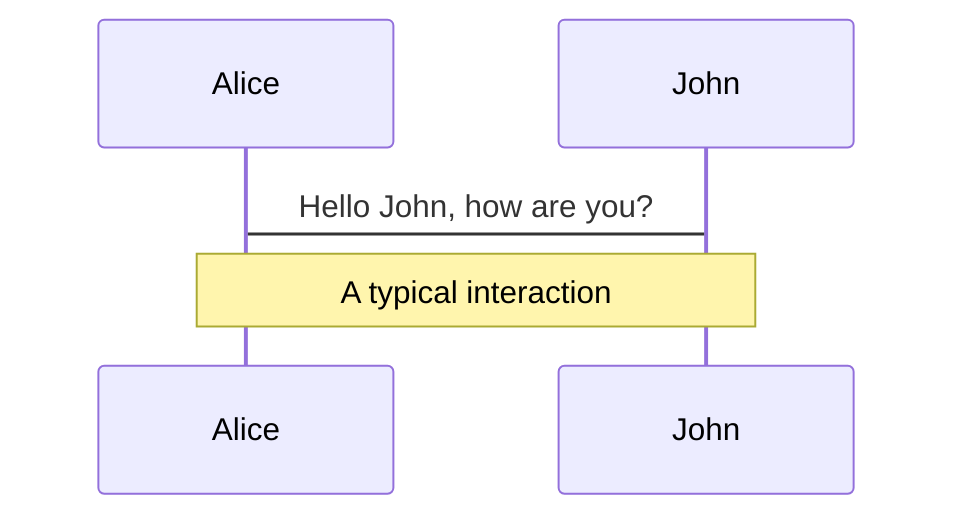
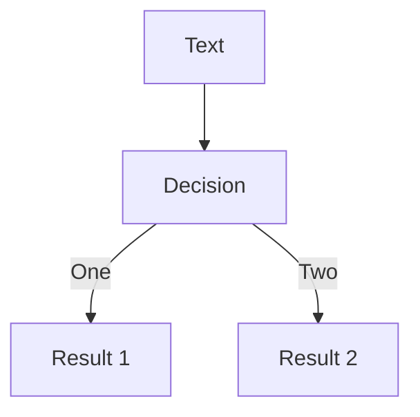
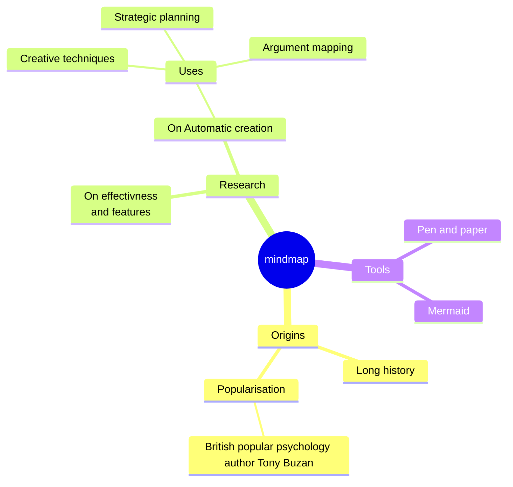
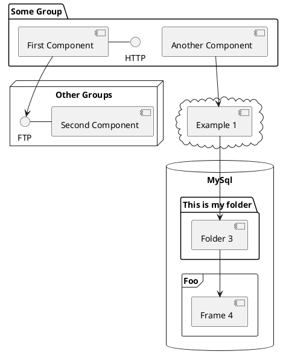

# The workshop you've been *await*ing for


Péter Leéh

<div class="pt-12">
  <span @click="$slidev.nav.next" class="px-2 py-1 rounded cursor-pointer" hover="bg-white bg-opacity-10">
    Press Space for next page <carbon:arrow-right class="inline"/>
  </span>
</div>

<div class="abs-br m-6 flex gap-2">
  <button @click="$slidev.nav.openInEditor()" title="Open in Editor" class="text-xl slidev-icon-btn opacity-50 !border-none !hover:text-white">
    <carbon:edit />
  </button>
  <a href="https://github.com/ptrskay3/async-await" target="_blank" alt="GitHub"
    class="text-xl slidev-icon-btn opacity-50 !border-none !hover:text-white"
    title="Source for this presentation"
    >
    <carbon-logo-github />
  </a>
</div>

<!--
The last comment block of each slide will be treated as slide notes. It will be visible and editable in Presenter Mode along with the slide. [Read more in the docs](https://sli.dev/guide/syntax.html#notes)
-->

---

## transition: fade-out

<div
  v-motion
  :initial="{ x: -80 }"
  :enter="{ x: 0 }">
  Slidev
</div>

# What is Slidev?

Slidev is a slides maker and presenter designed for developers, consist of the following features

- 📝 **Text-based** - focus on the content with Markdown, and then style them later
- 🎨 **Themable** - theme can be shared and used with npm packages
- 🧑‍💻 **Developer Friendly** - code highlighting, live coding with autocompletion
- 🤹 **Interactive** - embedding Vue components to enhance your expressions
- 🎥 **Recording** - built-in recording and camera view
- 📤 **Portable** - export into PDF, PNGs, or even a hostable SPA
- 🛠 **Hackable** - anything possible on a webpage

<br>
<br>

Read more about [Why Slidev?](https://sli.dev/guide/why)

<!--
You can have `style` tag in markdown to override the style for the current page.
Learn more: https://sli.dev/guide/syntax#embedded-styles
-->

<style>
h1 {
  background-color: #2B90B6;
  background-image: linear-gradient(45deg, #4EC5D4 10%, #146b8c 20%);
  background-size: 100%;
  -webkit-background-clip: text;
  -moz-background-clip: text;
  -webkit-text-fill-color: transparent;
  -moz-text-fill-color: transparent;
}
</style>

<!--
Here is another comment.
-->

---

# Navigation

Hover on the bottom-left corner to see the navigation's controls panel, [learn more](https://sli.dev/guide/navigation.html)

### Keyboard Shortcuts

|                                                    |                             |
| -------------------------------------------------- | --------------------------- |
| <kbd>right</kbd> / <kbd>space</kbd>                | next animation or slide     |
| <kbd>left</kbd> / <kbd>shift</kbd><kbd>space</kbd> | previous animation or slide |
| <kbd>up</kbd>                                      | previous slide              |
| <kbd>down</kbd>                                    | next slide                  |

<!-- https://sli.dev/guide/animations.html#click-animations -->


<p v-after class="absolute bottom-23 left-45 opacity-30 transform -rotate-10">Here!</p>

---

# Why concurrency is important?

<br>

<div v-click>

In the real world, you see complex independently behaving pieces.

<br>

Sequential software you write _does not_ model the real world's behavior well enough.

</div>

---

# Concurrency is not parallelism

..although it may enable parallelism.


<p v-click>

## An analogy

You need to fry 5 eggs. To cook an egg you crack it onto the griddle, wait for a few minutes, then take it off.

</p>

---

# Concurrency is not parallelism

<br>

- The <text class="font-extrabold text-transparent text-md bg-clip-text bg-gradient-to-r from-blue-400 to-red-600">sequential</text> approach is to fry the first egg to completion, then fry the second egg to completion, and so on, until you have 5 fried eggs.

<br>

<div v-click>

- The <text class="font-extrabold text-transparent text-md bg-clip-text bg-gradient-to-r from-blue-400 to-red-600">parallel</text> approach is to hire 5 cooks, tell each of them to fry an egg, and wait until they are all finished.

</div>

<br>

<div v-click>

- The <text class="font-extrabold text-transparent text-md bg-clip-text bg-gradient-to-r from-blue-400 to-red-600">concurrent</text> approach is that you cook all 5 eggs yourself the way you would actually do it. That is, you quickly crack each egg onto the pan, then take each one off when it's ready.

</div>
<br>

<div v-click>

- The <text class="font-extrabold text-transparent text-md bg-clip-text bg-gradient-to-r from-blue-400 to-red-600">concurrent and parallel</text> approach is to hire multiple cooks, and tell them to cook the eggs efficiently, as you would do in reality.

</div>

---

# Concurrency is not parallelism

<br>
<br>
<br>

<h3>
Did I choose the task of "frying eggs" by accident?
</h3>

<br>
<br>

<h3 v-click>No.</h3>
<br>
<br>

<h4 v-click>The number of cooks wasn't what was limiting you from going faster.</h4>

---


---

# IO-bound vs CPU-bound

<br>

Some tasks require work <text class="font-bold font-italic">from us</text> to complete. These are <text class="font-extrabold text-transparent text-md bg-clip-text bg-gradient-to-r from-blue-400 to-red-600">CPU-bound</text> tasks.

# TODO: Mention executors, but not here maybe

---

# What is concurrency?

Concurrency is being able to break your program into tasks and then interleave these tasks.

Concurrency is a way to structure software, particularly as a way to write clean code that interacts well with the real world.

It is not parallelism. Parallelism is different. (this line is unnecessary I guess)

# TODO: bring in leaky abstractions and the pendulum stuff..

# Also TODO: mention that CPU is much faster than network, memory, disk, etc..

---

# Preemptive vs cooperative

---

# Why concurrency is hard?

- simple vs double pendulum example ->

---

# Concurrency

Concurrent programming is less mature and "standardized" than regular, sequential programming. As a result, we express concurrency differently depending on which concurrent programming model the language is supporting. A brief overview of the most popular concurrency models can help you understand how asynchronous programming fits within the broader field of concurrent programming:

- **OS threads**
- **Event-driven programming**
- **Coroutines, green threads**
- **Actor model**
- **Async**

---

# OS threads

- The "original" way — lot of software are written this way

- Spawn an OS thread, do the work on that thread, then synchronize

- Synchronization is hard

- Large\(r) performance overhead, not suitable for massive IO bound workloads <span v-click> (yea, yea, threadpools..) </span>

---

# Event-driven programming

- The "callback" way

- Very verbose, "non-linear" control flow

- Data and errors are usually hard to follow

---

# Coroutines, green threads

- TODO: This is a very hairy topic, and there're generators even... https://stackoverflow.com/a/31151932/11751294 & https://stackoverflow.com/a/553745/11751294
  Needs a better explanation, and maybe separate the two topic a bit. An example could be good, and this may be useful: https://dev.to/thibmaek/explain-coroutines-like-im-five-2d9
  Also emphasize: you explicitly call suspend/resume, not like async await.

- Basically functions, that can be suspended and resumed.

- Supports large number of tasks

- Usually they're multiplexed dynamically to OS threads

- The `yield` keyword in Python, C#, Rust, etc..

- To even confuse you more, Go's goroutines are green threads really.

---

# Actor model

- Divides all computations into small units, called actors

- Actors communicate via message passing

- Actors can only make _local_ decisions:

  - start new actors
  - read messages and decide what to do with them
  - send message to others

- Real shared state and retry logic are usually a pain

---

# Async

- The modern way of concurrency, it's becoming supported in increasingly more languages.

- It lets you run a large number of concurrent tasks on a small number (can be even 1) of OS threads

- Tries to preserve much of the look and feel of ordinary synchronous programming, through the async/await syntax.

---

# Talk about OS vs lightweight threads - probably it's good to base this on the analogy.
---

# Code

```rust {all|11-16|6-8|all}
//! ```cargo
//! [dependencies]
//! reqwest = { version = "0.11", features = ["blocking"] }
//! ```
fn main() {
    for user in ["A", "B", "C", "D"] {
        println!("{}", get_user(user));
    }
}

fn get_user(name: &str) -> String {
    reqwest::blocking::get(format!("http://127.0.0.1:3001/{name}"))
        .unwrap()
        .text()
        .unwrap()
}
```

<br />

<div v-click>
```bash
╰─❯ timeit cargo +nightly -qZscript sync.rs
8sec 88ms 624µs 988ns
```
</div>

<arrow v-click x1="450" y1="500" x2="450" y2="550" color="#564" width="3" arrowSize="1" />

---

# JavaScript?

```js
function getUser(user) {
  return fetch(`http://127.0.0.1:3001/${user}`).then((resp) => resp.text());
}

for (const user of ['A', 'B', 'C', 'D']) {
  getUser(user).then((res) => console.log(res));
}
```

---

# JavaScript?

```js
function getUser(user) {
  return fetch(`http://127.0.0.1:3001/${user}`).then((resp) => resp.text());
}

for (const user of ['A', 'B', 'C', 'D']) {
  getUser(user).then((res) => console.log(res));
}
```

<br />
<br />

```bash
╰─❯ timeit deno run --allow-net sync_first_attempt.js
B
A
C
D
2sec 141ms 784µs
```

<br />
<div v-click>
This is clearly running concurrently.
</div>

---

# JavaScript?

```js {all|1-5|7-9|all}
async function getUser(name) {
  const response = await fetch(`http://127.0.0.1:3001/${name}`);
  const result = await response.text();
  return result;
}

for (const user of ['A', 'B', 'C', 'D']) {
  console.log(await getUser(user));
}
```

---

# Code

````rust
//! ```cargo
//! [dependencies]
//! reqwest = { version = "0.11", features = ["blocking"] }
//! ```
fn main() {
    for user in ["A", "B", "C", "D"] {
        println!("{}", get_user(user));
    }
}

fn get_user(name: &str) -> String {
    reqwest::blocking::get(format!("http://127.0.0.1:3001/{name}"))
        .unwrap()
        .text()
        .unwrap()
}
````

<br />

```bash
╰─❯ timeit cargo +nightly -qZscript sync.rs
8sec 88ms 624µs 988ns
```

<arrow v-click x1="450" y1="500" x2="450" y2="550" color="#564" width="3" arrowSize="1" />

---

# Code

```js {all|1|3|all} {maxHeight:'100px'}
function getUserAvatar(user) { ... }

const avatars = users.map(user => getUserAvatar(user));
```

---

# Code

```js
async function getUserAvatar(user) { ... }

const avatars = users.map(async (user) => await getUserAvatar(user));
```

<arrow v-click x1="200" y1="200" x2="100" y2="120" color="#564" width="3" arrowSize="1" />
<arrow v-click x1="400" y1="250" x2="290" y2="160" color="#564" width="3" arrowSize="1" />
<arrow v-click x1="500" y1="250" x2="390" y2="160" color="#564" width="3" arrowSize="1" />

<div v-click>
<div>
<br />
<br />
<br />
<br />

```js
[Promise { <pending> }, Promise { <pending> }, Promise { <pending> }, Promise { <pending> }]
```

</div>
</div>

---

# Code

```js
async function getUserAvatar(user) { ... }

const futures = users.map(user => getUserAvatar(user))

await Promise.all(futures)
```

---

# Code

```js
async function getUserAvatar(user) { ... }

const futures = users.map(user => getUserAvatar(user));

const avatars = [];
for await (const avatar of futures) {
  avatars.push(avatar);
}
```

---

```ts
async function getUserAvatar(user) {
  const defaultSize = { width: 420, height: 69 };

  const result = await queryDB(...);
  return resize(result.imageBuffer, result.preferredSize || defaultSize)
}
```

---

```ts {all|2-5|6-7|8-11}
async function getUserAvatar(user) {
  {
    const defaultSize = { width: 420, height: 69 };
    const future = queryDB(...)
  }
    // await future
    yield // ~> return
  {
    const result = future.output()
    return resize(result.imageBuffer, result.preferredSize || defaultSize)
  }
}
```

---

# Control flow

<br>
<br>

<table class="tg">
<thead>
  <tr>
    <th class="tg-0pky"></th>
    <th class="tg-0pky"><span style="font-weight:bold">Wait for all outputs</span><br></th>
    <th class="tg-0pky"><span style="font-weight:bold">Wait for first output</span><br></th>
  </tr>
</thead>
<tbody>
  <tr>
    <td class="tg-0pky"><span style="font-weight:bold">Continue on error</span><br></td>
    <td class="tg-0pky">Promise.allSettled<br></td>
    <td class="tg-0pky">Promise.any<br></td>
  </tr>
  <tr>
    <td class="tg-0pky"><span style="font-weight:bold">Return early with error</span><br></td>
    <td class="tg-0pky">Promise.all<br></td>
    <td class="tg-0pky">Promise.race<br></td>
  </tr>
</tbody>
</table>


---

# join

- a.k.a. _all_, _gather_, _await_many_,  ..

- Wait for multiple concurrent branches to complete, returning when **all** of them complete, or there was an error.

- Short-circuit on errors.

# TODO: maybe an useful example would be better for all..

```js
await Promise.all([promise1, promise2, ...promises])
```
- Either rejects completely, or returns all of the results in order.

---

# try_join

- a.k.a. _Promise.allSettled_

- Wait for multiple concurrent branches to complete, returning when **all** of them complete.

- Continue on errors.<sup>1</sup>

```js
await Promise.allSettled([promise1, promise2, ...promises])
```

- Returns a single promise, describing the outcome of each branch, and it resolved when all of the input's promises resolve/reject. 

<br>
<br>
<br>
<br>
<br>
<br>

<sup>1</sup> <text class="opacity-40">On error, the other branches are still running, they don't get cancelled.</text>
---

# select

- a.k.a. _Promise.race_, _WhenAny_, ...

- Launch all branches _concurrently_, then return with the first result when it resolves, or if there was an error.

- Short-circuit on errors.

```js
await Promise.race([promise1, promise2, ...promises])
```

---

# try_select

- a.k.a. _Promise.any_

- Launch all branches _concurrently_, then return with the first result when it completes regardless of the result.

```js
await Promise.any([promise1, promise2, ...promises])
```

---

# Structured concurrency 

---

# Channels


---

# Streams


---

# Async Cancellation

---

# maybe an interesting example here?

- more use cases here? 

---

# Gotchas

- message passing with channels > shared memory (usually)

---

# Executors, stackful vs stackless? probably not here, but important

---

# Components

<div grid="~ cols-2 gap-4">
<div>

You can use Vue components directly inside your slides.

We have provided a few built-in components like `<Tweet/>` and `<Youtube/>` that you can use directly. And adding your custom components is also super easy.

```html
<Counter :count="10" />
```

<!-- ./components/Counter.vue -->
<Counter :count="10" m="t-4" />

Check out [the guides](https://sli.dev/builtin/components.html) for more.

</div>
<div>

```html
<Tweet id="1390115482657726468" />
```

<Tweet id="1390115482657726468" scale="0.65" />

</div>
</div>

<!--
Presenter note with **bold**, *italic*, and ~~striked~~ text.

Also, HTML elements are valid:
<div class="flex w-full">
  <span style="flex-grow: 1;">Left content</span>
  <span>Right content</span>
</div>
-->

---

## class: px-20

# Themes

Slidev comes with powerful theming support. Themes can provide styles, layouts, components, or even configurations for tools. Switching between themes by just **one edit** in your frontmatter:

<div grid="~ cols-2 gap-2" m="-t-2">

```yaml
---
theme: default
---
```

```yaml
---
theme: seriph
---
```


</div>

Read more about [How to use a theme](https://sli.dev/themes/use.html) and
check out the [Awesome Themes Gallery](https://sli.dev/themes/gallery.html).

---

## preload: false

# Animations

Animations are powered by [@vueuse/motion](https://motion.vueuse.org/).

```html
<div v-motion :initial="{ x: -80 }" :enter="{ x: 0 }">Slidev</div>
```

<div class="w-60 relative mt-6">
  <div class="relative w-40 h-40">
    
    
    
  </div>

  <div
    class="text-5xl absolute top-14 left-40 text-[#2B90B6] -z-1"
    v-motion
    :initial="{ x: -80, opacity: 0}"
    :enter="{ x: 0, opacity: 1, transition: { delay: 2000, duration: 1000 } }">
    Slidev
  </div>
</div>

<!-- vue script setup scripts can be directly used in markdown, and will only affects current page -->
<script setup lang="ts">
const final = {
  x: 0,
  y: 0,
  rotate: 0,
  scale: 1,
  transition: {
    type: 'spring',
    damping: 10,
    stiffness: 20,
    mass: 2
  }
}
</script>

<div
  v-motion
  :initial="{ x:35, y: 40, opacity: 0}"
  :enter="{ y: 0, opacity: 1, transition: { delay: 3500 } }">

[Learn More](https://sli.dev/guide/animations.html#motion)

</div>

---

# LaTeX

LaTeX is supported out-of-box powered by [KaTeX](https://katex.org/).

<br>

Inline $\sqrt{3x-1}+(1+x)^2$

Block

$$
{1|3|all}
\begin{array}{c}

\nabla \times \vec{\mathbf{B}} -\, \frac1c\, \frac{\partial\vec{\mathbf{E}}}{\partial t} &
= \frac{4\pi}{c}\vec{\mathbf{j}}    \nabla \cdot \vec{\mathbf{E}} & = 4 \pi \rho \\

\nabla \times \vec{\mathbf{E}}\, +\, \frac1c\, \frac{\partial\vec{\mathbf{B}}}{\partial t} & = \vec{\mathbf{0}} \\

\nabla \cdot \vec{\mathbf{B}} & = 0

\end{array}
$$

<br>

[Learn more](https://sli.dev/guide/syntax#latex)

---

# Diagrams

You can create diagrams / graphs from textual descriptions, directly in your Markdown.

<div class="grid grid-cols-4 gap-5 pt-4 -mb-6">









</div>

[Learn More](https://sli.dev/guide/syntax.html#diagrams)

---

src: ./pages/multiple-entries.md
hide: false

---

---

layout: center
class: text-center

---

# Learn More

[Documentations](https://sli.dev) · [GitHub](https://github.com/slidevjs/slidev) · [Showcases](https://sli.dev/showcases.html)
