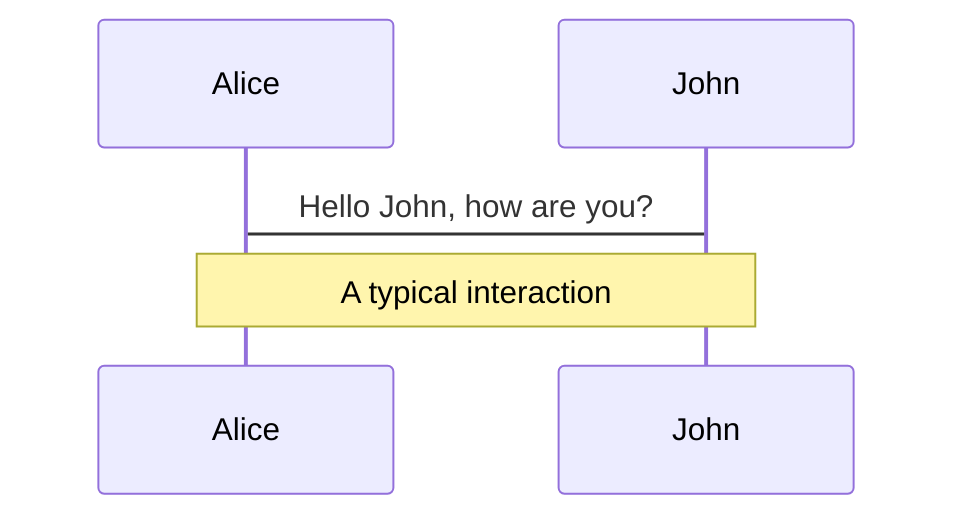
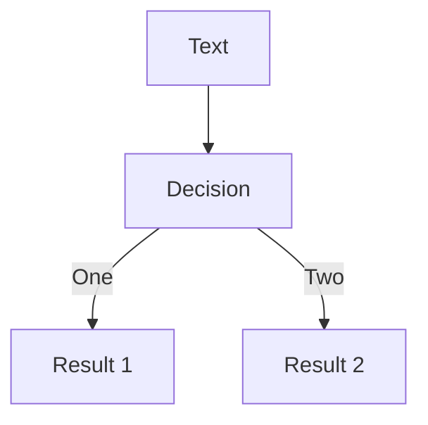
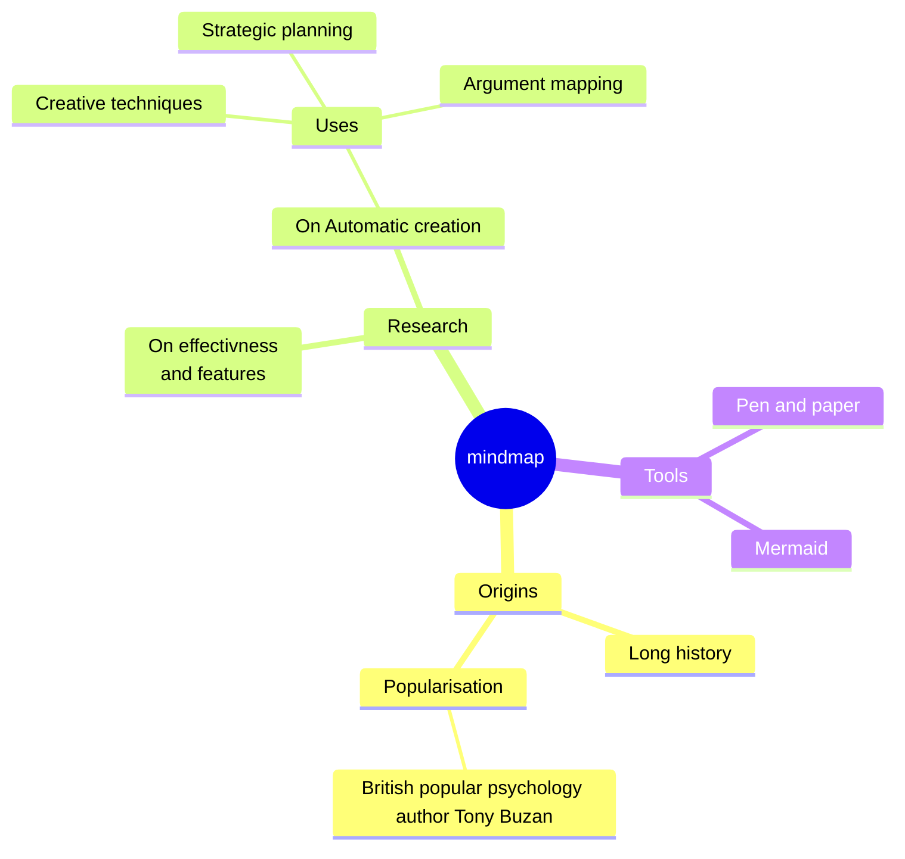
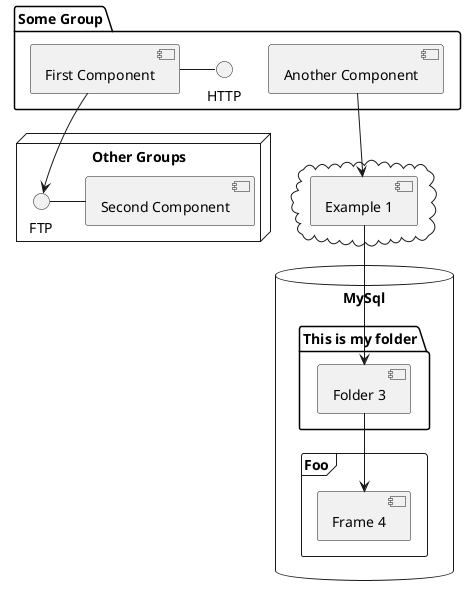

# Hello, _async_ world!


Péter Leéh

<div class="abs-br m-6 flex gap-2">
  <a href="https://github.com/ptrskay3/async-await" target="_blank" alt="GitHub"
    class="text-xl slidev-icon-btn opacity-50 !border-none !hover:text-white"
    title="Source for this presentation"
    >
    <carbon-logo-github />
  </a>
</div>

<!--
The last comment block of each slide will be treated as slide notes. It will be visible and editable in Presenter Mode along with the slide. [Read more in the docs](https://sli.dev/guide/syntax.html#notes)
-->

---

# Concurrency is not parallelism

..although it may enable parallelism.


<p v-click>

## An analogy

You need to fry 4 eggs. To cook an egg you crack it onto the griddle, wait for a few minutes, then take it off.

</p>

---

# Concurrency is not parallelism

<br>

- The <text class="font-extrabold text-transparent text-md bg-clip-text bg-gradient-to-r from-blue-400 to-red-600">sequential</text> approach is to fry the first egg to completion, then fry the second egg to completion, and so on, until you have 4 fried eggs.

<br>

<div v-click>

- The <text class="font-extrabold text-transparent text-md bg-clip-text bg-gradient-to-r from-blue-400 to-red-600">parallel</text> approach is to hire 4 cooks, tell each of them to fry an egg, and wait until they are all finished.

</div>

<br>

<div v-click>

- The <text class="font-extrabold text-transparent text-md bg-clip-text bg-gradient-to-r from-blue-400 to-red-600">concurrent</text> approach is that you cook all 4 eggs yourself the way you would actually do it. That is, you quickly crack each egg onto the pan, then take each one off when it's ready.

</div>
<br>

<div v-click>

- The <text class="font-extrabold text-transparent text-md bg-clip-text bg-gradient-to-r from-blue-400 to-red-600">concurrent and parallel</text> approach is to hire multiple cooks, and tell them to cook the eggs efficiently, as you would do in reality.

</div>

---

# Concurrency is not parallelism

<br>
<br>
<br>

<h3>
Did I choose the task of "frying eggs" by accident?
</h3>

<br>
<br>

<h3 v-click>No.</h3>
<br>
<br>

<h4 v-click>The number of cooks wasn't what was limiting you from going faster.</h4>

---


---

# CPU-bound vs. IO-bound

<br>

### For some tasks, most of the work is required <text class="font-bold font-italic">from us</text> to complete. Meaning, if we're faster, the task should be faster to finish. These are <text class="font-extrabold text-transparent text-md bg-clip-text bg-gradient-to-r from-blue-400 to-red-600">CPU-bound</text> tasks.


<br>

<div v-click>

- Math, string searching, image rendering, etc.

</div>

<div v-click>

- Parallelism (usually) helps with __CPU-bound__ tasks.

</div>

<br>

<div v-click>


### On the other hand, for some tasks, we're not in control how fast they're going to complete — it depends on <text class="font-bold font-italic">external factors</text>. These are called <text class="font-extrabold text-transparent text-md bg-clip-text bg-gradient-to-r from-blue-400 to-red-600">IO-bound</text> tasks.

</div>

<br>

<div v-click>

- Dealing with network (databases, APIs) and files.

</div>

<div v-click>

- Concurrency helps with __IO-bound__ tasks.

</div>

<br>

---

# What is concurrency? Why is it important?

- Concurrency is being able to break your program into tasks and then interleave these tasks.

- Work units are paused and resumed sequentially

- Fast switching between them gives the illusion of "parallel"

- In reality, the fastest part of computers is the CPU — memory, disk, network are all much slower.

- Dealing with network and files is ~90% of software you usually write.


---


# Concurrency is hard

<Youtube class="w-200 h-100" id="bXxCxhZCCUA"/>

---

# Cooperative and preemptive scheduling

<br>
<br>


- <text class="font-extrabold text-transparent text-md bg-clip-text bg-gradient-to-r from-blue-400 to-red-600">Cooperative scheduling</text> when each task is willing to give up control cooperatively.
  - If a task holds control for a long time, it blocks others from making progress
  - We'll see later, async-await is a form of cooperative multitasking (Python, JavaScript, C#, ...)

<br>
<br>

- <text class="font-extrabold text-transparent text-md bg-clip-text bg-gradient-to-r from-blue-400 to-red-600">Preemptive scheduling</text> when tasks are being "preemptively" stopped without the task being aware of it
  - No explicit way to pause/resume.
  - OS[^1] threads, Goroutines (Go), BEAM VM (Elixir) use this type of scheduling

<br>
<br>
<br>
<br>
<br>
<br>
<br>
<br>

[^1]: Windows and Mac used to use cooperative scheduling ~15 year ago.

---
layout: image-left
image: schedulers_.png
---
# Schedulers

- Schedulers control what task to run on what worker, and when.
- Minimize ready-time and also waiting-time
- Not a busy-loop

---

# Question

- Context..

<br>

```python
import requests

def fry_egg(name):
    return requests.get(f'http://localhost:3001/{name}').text

for egg in ['A', 'B', 'C', 'D']:
    print(fry_egg(egg))
```

<br />

<div v-click>
```bash
╰─❯ timeit python3 sync.py
8sec 88ms 624µs 988ns
```
</div>

<br>

<div v-click>

### Is this code _correct?_

</div>

<br>

<div v-click>


### Is this code _efficient?_

</div>

<Logo src="/python_logo.png" class="w-10" />


---

# Concurrency

Concurrent programming is less mature and "standardized" than regular, sequential programming. As a result, we express concurrency differently depending on which concurrent programming model the language is supporting. A brief overview of the most popular concurrency models:

<br />

- **OS threads**
- **Event-driven programming**
- **Coroutines, green threads**
- **Actor model**
- **Async-await**

---

# OS threads

- The "original" way — lot of software are written this way

- Spawn an OS thread, do the work on that thread, then synchronize

- They __may__ run in parallel, not just concurrently.

- Not suitable for massive IO bound workloads
  - Context switching is still expensive
  - Larger memory overhead
  - In some languages it's hard/annoying to use.
  - Synchronization is hard

- C, C++, Rust, Java, C#, ..

---

# OS threads

<br>

```rust {all|1|4-9|11-14|all}
fn fry_egg(name: &str) -> String { /* ... */ }

fn main() {
    let mut handles = vec![];

    for name in &["A", "B", "C", "D"] {
        let handle = std::thread::spawn(move || fry_egg(name));
        handles.push(handle);
    }

    for handle in handles {
        let result = handle.join().unwrap();
        println!("{result}");
    }
}
```

<Logo src="/rust_logo.png" class="w-10 dark:invert" />

---

# OS threads

<br>


```rust {all|4-8|all}
fn fry_egg(name: &str) -> String { /* ... */ }

fn main() {
    std::thread::scope(|scope| {
        for name in &["A", "B", "C", "D"] {
            scope.spawn(move || println!("{}", fry_egg(name)));
        }
    });
}
```

<Logo src="/rust_logo.png" class="w-10 dark:invert" />

---

# Event-driven programming

- The "callback" way

- Very verbose, "non-linear" control flow

- Data and errors are usually hard to follow

- Works well for a certain problems (UI)

- Possible in (sort of) any language

---

# Event-driven programming

```js {all|3|4-5,15|6-9|11-13|all}
const http = require('http');

for (const egg of ['A', 'B', 'C', 'D']) {
  http
    .get(`http://localhost:3001/${egg}`, (res) => {
      let data = [];
      res.on('data', (chunk) => {
        data.push(chunk);
      });

      res.on('end', () => {
        console.log(Buffer.concat(data).toString());
      });
    })
    .on('error', (err) => {
      console.log('Error: ', err.message);
    });
}
```
<br>

<div class="flex flex-col h-screen items-center">
  <text class="text-xl" v-click>🫠</text>
</div>


<Logo src="javascript_logo.png" class="w-10" />

---

# Coroutines, green threads

- <text class="font-extrabold text-transparent text-md bg-clip-text bg-gradient-to-r from-blue-400 to-red-600">Coroutine</text>: Basically functions, that can be suspended and resumed.
  - The current state of the function is saved, then yields control back to the calling function.
  - When it's resumed, its state will be restored to the point where the 'yield' was encountered and execution will continue.

- <text class="font-extrabold text-transparent text-md bg-clip-text bg-gradient-to-r from-blue-400 to-red-600">Green thread</text>: Similar to OS threads, but much more "lightweight".
  - Managed by the language runtime/library, not the OS.
  - They're multiplexed dynamically to OS threads.

- They are largely related, green threads are the underlying mechanism to execute coroutines.

- Supports large number of tasks

- They are related to generators and the `yield` keyword in some languages

- Python, Go, Kotlin

---

# Coroutines, green threads


```go {all|17|3|5,8-12|all}
func main() {
	var wg sync.WaitGroup
	eggs := [4]string{"A", "B", "C", "D"}

	for _, egg := range eggs {
		wg.Add(1)
		egg := egg
		go func() {
			fmt.Println(fryEgg(egg))
			wg.Done()
		}()
	}

	wg.Wait()
}

func fryEgg(name string) string { /* ... */ }
```

<div v-click>

- Goroutines: stackful, concurrent, preemptively scheduled tasks

</div>

<Logo src="/go_logo.png" class="w-10" />

---

# Actor model

- Divides all computations into small units, called actors

- Actors communicate via message passing

- No shared memory at all, no global state

- Isolation — one actor crashing doesn't affect the other

- Actors can only make _local_ decisions:

  - start new actors
  - read messages and decide what to do with them
  - send message to others

- Real shared state and retry logic are usually a pain

- Erlang, Elixir mostly, but possible in a lot of languages through frameworks.

---

# Actor model

```elixir {all|1-6|8-9|11-13|15-19|4,16|all}
defmodule Actor do
  def fry_egg(name, caller) do
    {:ok, {_, _, body}} = :httpc.request("http://127.0.0.1:3001/#{name}")
    send(caller, body)
  end
end

caller = self()
eggs = ["A", "B", "C", "D"]

for name <- eggs do
  spawn(Actor, :fry_egg, [name, caller])
end

Enum.each(eggs, fn _ ->
  receive do
    egg -> IO.inspect(egg)
  end
end)

```
<Logo src="/elixir_logo.png" class="w-10" />

---

# Async-await

- The modern way of concurrency, it's becoming supported in increasingly more languages.

- It lets you run a large number of concurrent tasks on a small number (can be even 1) of OS threads

- Tries to preserve much of the look and feel of ordinary synchronous programming, through the async/await syntax.
  - ..but it's a [leaky abstraction.](https://www.joelonsoftware.com/2002/11/11/the-law-of-leaky-abstractions/)

- JavaScript, C#, Rust, Swift

---

# Async-await

```js
async function fryEgg(user) {
  const response = await fetch(`http://127.0.0.1:3001/${user}`);
  const result = await response.text();
  return result;
}

const eggs = ['A', 'B', 'C', 'D'];

const response = await Promise.all(eggs.map((user) => fryEgg(user)));
console.log(response);
```

<Logo src="/javascript-logo.png" class="w-10" />

---

# Let's talk about JavaScript!

- JavaScript said to be _asynchronous and single threaded_.

```js
function fryEgg(egg) {
  return fetch(`http://127.0.0.1:3001/${egg}`).then((resp) => resp.text());
}

for (const egg of ['A', 'B', 'C', 'D']) {
  fryEgg(egg).then((res) => console.log(res));
}
```

---

# JavaScript?

```js
function fryEgg(egg) {
  return fetch(`http://127.0.0.1:3001/${egg}`).then((resp) => resp.text());
}

for (const egg of ['A', 'B', 'C', 'D']) {
  fryEgg(egg).then((res) => console.log(res));
}
```

<br />
<br />

```bash
╰─❯ timeit deno run --allow-net sync_first_attempt.js
B
A
C
D
2sec 141ms 784µs
```

<br />
<div v-click>
This is clearly running concurrently.
</div>

---

# JavaScript?

```js {all|1-5|7-9|all}
async function fryEgg(name) {
  const response = await fetch(`http://127.0.0.1:3001/${name}`);
  const result = await response.text();
  return result;
}

for (const egg of ['A', 'B', 'C', 'D']) {
  console.log(await fryEgg(egg));
}
```

--- 

# Async under the hood

Consider the following async function

```ts
async function gatherUserInfo(user) {
  const unused = 0;
  const userPreferences = calculateUserPreferences(user);
  const pictures = await queryPictures(user, userPreferences);
  
  return { name: user.name, preferences: userPreferences, pictures };
}
```

<Logo src="/javascript_logo.png" class="w-10" />

<!--
While it’s common to use async without knowing exactly what’s happening under the hood, I’m a firm believer that understanding how something actually works helps you to make even better use of it. For async/await in particular, understanding the mechanisms involved is especially helpful when you want to look below the surface, such as when you’re trying to debug things gone wrong or improve the performance of things otherwise gone right. In this post, then, we’ll deep-dive into exactly how await works at the language, compiler, and library level, so that you can make the most of these valuable features.
 -->

---

# Async under the hood

```ts {all|2-6|7-8|9-12|all}
async function gatherUserInfo(user) {
  {
    const unused = 0;
    const userPreferences = calculateUserPreferences(user);
    const promise = queryPictures(user, userPreferences)
  }
    // await promise
    yield // ~> return
  {
    const pictures = promise.output()
    return { name: user.name, preferences: userPreferences, pictures }
  }
}
```

<br>

<div v-click>

```ts
const State1 = { user, userPreferences, promise };
const State2 = { user, userPreferences, pictures }; 
type StateMachine = typeof State1 | typeof State2;
```

_(This is not actual working code, just to help you understand the model)_

</div>

<Logo src="/javascript_logo.png" class="w-10" />

---

# Async under the hood

- Basically _all_ languages with async support does this underneath the covers — including 

  - [Python](https://tenthousandmeters.com/blog/python-behind-the-scenes-12-how-asyncawait-works-in-python/)

  - [C#](https://devblogs.microsoft.com/dotnet/how-async-await-really-works/)

  - [Swift](https://swiftrocks.com/how-async-await-works-internally-in-swift)

  - [Rust](https://www.youtube.com/watch?v=ThjvMReOXYM)

<br>

- Generally you should appreciate what async-await abstracts away
  - A recent `curl` [CVE](https://daniel.haxx.se/blog/2023/10/11/how-i-made-a-heap-overflow-in-curl/) was ultimately caused by a failure to recognize state that needed to be saved during a state transition. This kind of logic error is easy to make when implementing a state machine by hand.


---

# Control flow

<br>
<br>

<table class="tg">
<thead>
  <tr>
    <th class="tg-0pky"></th>
    <th class="tg-0pky"><span style="font-weight:bold">Wait for all outputs</span><br></th>
    <th class="tg-0pky"><span style="font-weight:bold">Wait for first output</span><br></th>
  </tr>
</thead>
<tbody>
  <tr>
    <td class="tg-0pky"><span style="font-weight:bold">Continue on error</span><br></td>
    <td class="tg-0pky">Promise.allSettled<br></td>
    <td class="tg-0pky">Promise.any<br></td>
  </tr>
  <tr>
    <td class="tg-0pky"><span style="font-weight:bold">Return early with error</span><br></td>
    <td class="tg-0pky">Promise.all<br></td>
    <td class="tg-0pky">Promise.race<br></td>
  </tr>
</tbody>
</table>


---

# join/try_join

- a.k.a. _Promise.all_/_Promise.allSettled_, _Task.WaitAll_, _asyncio.gather_, _Task.await_many_, ..

- Wait for multiple concurrent branches to complete, returning when **all** of them complete.
  - try_join: short-circuit on errors, cancel all remaining branches
  - join: keep going on errors, report them at the end.

- Downloading multiple things at once, reading multiple files, (frying multiple eggs), ..

```js
async function attempt_to_get_two_sites_concurrently() {
    let foo_page = await download_page("https://www.foo.com");
    let bar_page = await download_page("https://www.bar.com");
    return [foo_page, bar_page];
}
```
---

# join/try_join

- a.k.a. _Promise.all_/_Promise.allSettled_, _Task.WaitAll_, _asyncio.gather_, _Task.await_many_, ..

- Wait for multiple concurrent branches to complete, returning when **all** of them complete.
  - try_join: short-circuit on errors, cancel all remaining branches
  - join: keep going on errors, report them at the end.

- Downloading multiple things at once, reading multiple files, (frying multiple eggs), ..


```js {none}
async function attempt_to_get_two_sites_concurrently() {
    let foo_page = await download_page("https://www.foo.com");
    let bar_page = await download_page("https://www.bar.com");
    return [foo_page, bar_page];
}
```

- ❌ WRONG - don't do that. Instead, do this:

```js
async function get_two_sites_concurrently() {
    let foo_page = download_page("https://www.foo.com");
    let bar_page = download_page("https://www.bar.com");
    return await Promise.all([foo_page, bar_page]);
}
```

---

# select/try_select

- a.k.a. _Promise.race_/_Promise.any_, _Task.WhenAny_, _asyncio.wait_ ...

- Launch all branches _concurrently_, then return with the first result when it resolves.
  - try_select: short-circuit on errors, cancel the remaining branches
  - select: keep going on errors, returns the first non-error result

- Timeouts, graceful shutdowns, load balancing, etc..

```js
async function race_two_sites_with() {
    let foo_page = download_page("https://www.foo.com");
    let bar_page = download_page("https://www.bar.com");
    return await Promise.race([foo_page, bar_page]);
}
```

---
layout: image-left
backgroundSize: clip
image: structured_concurrency_1.png
---
# Structured concurrency

- A property that improves quality and clarity of concurrent programs.
- It doesn't matter how many concurrent things are happening, the program structure is always a tree. No cycles, no dangling nodes.

---
layout: image-left
backgroundSize: clip
image: structured_concurrency_2.png
---
# Structured concurrency

- Three properties must hold:
  - __Cancellation propagation__: When a task is cancelled, it's guaranteed that all tasks underneath are also cancelled.
  - __Error propagation__: When an error is created in the call-graph, it can always be propagated up to the callers, until there is a caller that handles it.
  - __Ordering of operations__: When a function returns, you know it is done doing work.

- Black box model of execution — the result code is composable.

---

# Channels - too much text on this slide

- A communication/synchronization model via message passing. Can be used with OS threads, async context, coroutines.. basically everywhere.
- They're usually very efficient, and if the design allows, they're often better than sharing memory with mutexes or similar.

- __1:1__: One-to-one relationship. Just like a real-world channel, it has two ends, and they can communicate.
- __1:N__: One-to-many relationship. One sender communicates with many receivers. E.g. broadcasting messages to clients
- __N:1__: Many-to-one relationship. Many senders and one receiver communicates. E.g. Gathering results from multiple sources.
- __N:M__: Many-to-many relationship. Many senders, many receivers. E.g. a chat, or basically any distributed system.

- These are not always distinguished. An N:M channel basically can handle all the other special cases too.
- Bounded + Backpressure, Unbounded

---

# Channels

 In Go, channels are first-class citizens.

```go {all|2|7-9|12-18|all}
func main() {
	channel := make(chan string)
	eggs := [4]string{"A", "B", "C", "D"}

	for _, egg := range eggs {
		egg := egg
		go func() {
			channel <- fryEgg(egg)
		}()
	}

	select {
	  case response := <- channel:
		fmt.Println(response)
      case <- time.After(5 * time.Second):
        fmt.Println("Timed out")
        return
	}
}

func fryEgg(name string) string { /* ... */ }
```

<Logo src="/go_logo.png" class="w-10" /> 

---

# Channels

```rust {all|4|6-11|13-17|all}
use std::sync::mpsc::channel;

fn main() {
    let (sender, receiver) = channel();

    std::thread::scope(|scope| {
        for name in &["A", "B", "C", "D"] {
            let sender = sender.clone();
            scope.spawn(move || sender.send(fry_egg(name)).unwrap());
        }
    });

    drop(sender);
    while let Ok(item) = receiver.recv() {
        println!("{item}");
    }
}

fn fry_egg(name: &str) -> String { /* ... */ }
```

<Logo src="/rust_logo.png" class="w-10 dark:invert" />

---

# Streams

- Asynchronous equivalent of for loops, each item is yielded asynchronously

<br>

```js
for await (const egg of eggs) {
  console.log(egg);
}
```

(JavaScript is kind of a special kid here, see `examples/stream/for-await-actually.js`)

- For IO-bound iterations, it's already non-blocking
- Can be used when asynchronous tasks have a dependency on each other (e.g. we need to know the previous result to continue)
- Flexible, they can be buffered, unordered, chunked, etc..
- Streams are used for infinite scrolls, requesting for paginated results

---

# Async cancellation & async destructors - maybe a word or two, but ths is too advanced

---

# Gotchas

(just sketches, needs examples and details)

- Don't use async when it's not necessary, especially don't run multithreaded for a few async stuff.
- Don't mix heavy synchronous and asynchronous code -> blocking the caller thread
- message passing with channels > shared memory (usually)
- shared memory deadlock - be careful with dependencies on other tasks

---


# Components

<div grid="~ cols-2 gap-4">
<div>

You can use Vue components directly inside your slides.

We have provided a few built-in components like `<Tweet/>` and `<Youtube/>` that you can use directly. And adding your custom components is also super easy.


```html
<Counter :count="10" />
```

<!-- ./components/Counter.vue -->
<Counter :count="10" m="t-4" />

Check out [the guides](https://sli.dev/builtin/components.html) for more.

</div>
<div>

```html
<Tweet id="1390115482657726468" />
```

<Tweet id="1390115482657726468" scale="0.65" />

</div>
</div>

<!--
Presenter note with **bold**, *italic*, and ~~striked~~ text.

Also, HTML elements are valid:
<div class="flex w-full">
  <span style="flex-grow: 1;">Left content</span>
  <span>Right content</span>
</div>
-->

---

## class: px-20

# Themes

Slidev comes with powerful theming support. Themes can provide styles, layouts, components, or even configurations for tools. Switching between themes by just **one edit** in your frontmatter:

<div grid="~ cols-2 gap-2" m="-t-2">

```yaml
---
theme: default
---
```

```yaml
---
theme: seriph
---
```


</div>

Read more about [How to use a theme](https://sli.dev/themes/use.html) and
check out the [Awesome Themes Gallery](https://sli.dev/themes/gallery.html).

---

## preload: false

# Animations

Animations are powered by [@vueuse/motion](https://motion.vueuse.org/).

```html
<div v-motion :initial="{ x: -80 }" :enter="{ x: 0 }">Slidev</div>
```

<div class="w-60 relative mt-6">
  <div class="relative w-40 h-40">
    
    
    
  </div>

  <div
    class="text-5xl absolute top-14 left-40 text-[#2B90B6] -z-1"
    v-motion
    :initial="{ x: -80, opacity: 0}"
    :enter="{ x: 0, opacity: 1, transition: { delay: 2000, duration: 1000 } }">
    Slidev
  </div>
</div>

<!-- vue script setup scripts can be directly used in markdown, and will only affects current page -->
<script setup lang="ts">
const final = {
  x: 0,
  y: 0,
  rotate: 0,
  scale: 1,
  transition: {
    type: 'spring',
    damping: 10,
    stiffness: 20,
    mass: 2
  }
}
</script>

<div
  v-motion
  :initial="{ x:35, y: 40, opacity: 0}"
  :enter="{ y: 0, opacity: 1, transition: { delay: 3500 } }">

[Learn More](https://sli.dev/guide/animations.html#motion)

</div>

---

# LaTeX

LaTeX is supported out-of-box powered by [KaTeX](https://katex.org/).

<br>

Inline $\sqrt{3x-1}+(1+x)^2$

Block

$$
{1|3|all}
\begin{array}{c}

\nabla \times \vec{\mathbf{B}} -\, \frac1c\, \frac{\partial\vec{\mathbf{E}}}{\partial t} &
= \frac{4\pi}{c}\vec{\mathbf{j}}    \nabla \cdot \vec{\mathbf{E}} & = 4 \pi \rho \\

\nabla \times \vec{\mathbf{E}}\, +\, \frac1c\, \frac{\partial\vec{\mathbf{B}}}{\partial t} & = \vec{\mathbf{0}} \\

\nabla \cdot \vec{\mathbf{B}} & = 0

\end{array}
$$

<br>

[Learn more](https://sli.dev/guide/syntax#latex)

---

# Diagrams

You can create diagrams / graphs from textual descriptions, directly in your Markdown.

<div class="grid grid-cols-4 gap-5 pt-4 -mb-6">









</div>

[Learn More](https://sli.dev/guide/syntax.html#diagrams)

---

src: ./pages/multiple-entries.md
hide: false

---

---

layout: center
class: text-center

---

# Source

- https://stackoverflow.com/a/31151932/11751294 
- https://stackoverflow.com/a/553745/11751294 
- https://dev.to/thibmaek/explain-coroutines-like-im-five-2d9


[Documentations](https://sli.dev) · [GitHub](https://github.com/slidevjs/slidev) · [Showcases](https://sli.dev/showcases.html)
